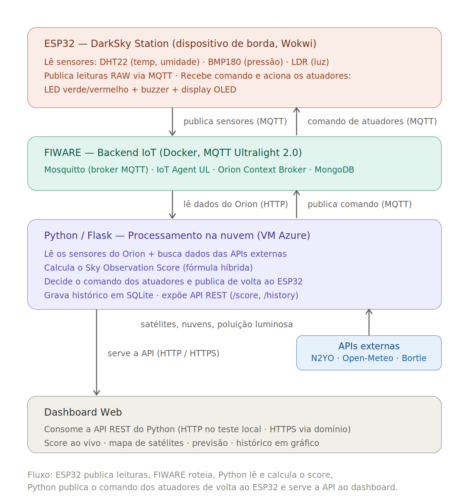

# Sky Aware — DarkSky Station
### Edge Computing & Computer Systems · Global Solution 2026 · FIAP

> Estação de monitoramento hiperlocal do céu noturno. Coleta dados físicos do ambiente via ESP32, integra com dados orbitais de satélites em tempo real e calcula o **Sky Observation Score** — um índice de 0 a 10 que indica a qualidade do céu para observação astronômica. Inclui telemetria ao vivo, histórico persistido e alertas físicos (LED + buzzer + display OLED).

---

## Equipe — 1ESPA

| Nome | RM |
|---|---|
| João Victor Melo Santos | 566640 |
| Murilo Jeronimo Ferreira Nunes | 560641 |
| Vinicius Kozonoe Guaglini | 567264 |
| Yan Lucas Gonçalves da Silva | 567046 |
| Bruno Santos Castilho | 566799 |

---

## Links

| Recurso | Link |
|---|---|
| Repositório GitHub | https://github.com/JoaoVictorMelo10/skyaware-edge-computing |
| Simulação Wokwi | https://wokwi.com/projects/465279238243903489 |
| Dashboard de teste (validação da API Edge) | `site/dashboard-teste.html` |
| Site final da plataforma Sky Aware | https://lucx-yan.github.io/skyaware |

---

## O Problema

Desde 2019, constelações como Starlink (SpaceX), Kuiper (Amazon) e OneWeb colocaram mais de 6.000 satélites em órbita baixa (LEO). Cada satélite reflete luz solar e aparece como rastro nas fotografias astronômicas. O Vera C. Rubin Observatory estima que até **30% de suas imagens científicas** de longa exposição já são contaminadas por rastros de satélites.

Mas o problema não é só orbital — condições físicas locais como umidade alta (turbulência atmosférica), pressão instável (frentes frias) e poluição luminosa do local de observação também inviabilizam uma sessão.

> **Nenhum satélite consegue medir a luminosidade em tempo real do seu ponto de observação. Nenhum servidor na nuvem sabe se há neblina no seu local agora. O ESP32 sabe.**

A **DarkSky Station** resolve isso: é o dispositivo de borda que fica no ponto de observação, e funciona em dois modos:

- **No local, com o observador presente** (ex: o quintal de casa): os atuadores físicos dão feedback imediato — LED verde/vermelho, buzzer e display OLED dizem na hora se vale observar, sem precisar olhar o celular.
- **Instalado num ponto fixo remoto** (ex: um sítio de céu escuro a dezenas de quilômetros): a Station continua medindo e publicando os dados na nuvem via FIWARE, e o observador consulta as condições daquele ponto à distância, pelo site, antes de se deslocar até lá.

Nos dois casos, ela mede o ambiente físico exatamente onde a observação acontece e combina esse dado com a inteligência orbital processada na nuvem.

---

## Por que Edge Computing é essencial aqui

O ESP32 não é um sensor passivo. Ele é o **ponto de convergência entre a inteligência orbital (macro, global) e a inteligência local (no ponto exato de observação)**: mede fisicamente o ambiente onde a observação acontece, publica via MQTT, recebe de volta uma decisão calculada na nuvem e a executa como ação concreta — aciona LED verde/vermelho, buzzer e display OLED para quem está no local. Um site puro ou uma API orbital trabalham apenas com dados macro; enquanto as previsões meteorológicas operam em escala de quilômetros, a DarkSky Station mede o céu exatamente onde o telescópio está.

---

## Arquitetura do Sistema



A arquitetura é de mão dupla: o dado orbital desce do espaço, chega ao Python na nuvem, é cruzado com os dados físicos medidos pelo ESP32, e retorna ao dispositivo de borda como uma ação concreta.

---

## Sky Observation Score — Fórmula Híbrida

O score é calculado inteiramente pelo Python na VM (padrão Fog/Cloud: a inteligência fica na nuvem, o ESP32 é coletor + executor). O ESP32 fornece os dados físicos brutos e executa os comandos recebidos — não calcula o score localmente.

### Portões de corte absoluto

| Condição | Resultado | Motivo |
|---|---|---|
| Cobertura de nuvens ≥ 85% | Score = 0.0 | Observação inviável |
| Poluição luminosa ≥ 90% | Score = 1.0 | Mínimo histórico |

A lógica linear pura tinha um problema crítico: céu 100% nublado + condições orbitais perfeitas podia gerar score alto. A fórmula híbrida resolve isso separando fatores **cumulativos** (reduzem gradualmente) de fatores **restritivos** (zeram o score via portões de corte).

### Cálculo completo

```
FATOR LOCAL — sensores do ESP32 (0 a 1):
  hum_score      = 1.0 − (umidade / 100)
  pressure_score = (pressão − 980) / 50        [clamp 0–1]
  darkness_score = (4095 − ldr_raw) / 4095
  f_local        = (hum_score + pressure_score + darkness_score) / 3

FATOR ORBITAL — via N2YO (0.3 a 1.0):
  n = nº de Starlink num raio de 40° sobre o observador
  f_orbital = max(0.3, 1.0 − (n / 50) × 0.7)

BASE PONDERADA:
  B = (f_orbital × 0.7) + (f_local × 0.3)

MULTIPLICADORES DE CORTE:
  M_atm = 1.0 − cobertura_nuvens        [Open-Meteo]
  M_lum = 1.0 − (polv_luminosa × 0.5)   [BORTLE_MAP]

SCORE FINAL (0 a 10):
  Score = B × M_atm × M_lum × 10
```

### Comportamento dos atuadores (LED, buzzer e OLED)

| Score | LED Verde | LED Vermelho | Buzzer | Status no OLED |
|---|---|---|---|---|
| ≥ 7.0 | ACESO | Apagado | 1 beep curto | `CEU IDEAL` |
| 4.0 – 6.9 | Apagado | Apagado | Silêncio | `MODERADO` |
| < 4.0 | Apagado | ACESO | Bipes intermitentes | `CEU RUIM` |

---

## Parâmetros de Telemetria Monitorados

O sistema monitora múltiplos parâmetros (requisito: ao menos 3), combinando sensores físicos e dados orbitais:

| Parâmetro | Origem | Papel |
|---|---|---|
| Temperatura | DHT22 (ESP32) | Contexto ambiental |
| Umidade | DHT22 (ESP32) | Turbulência atmosférica (seeing) |
| Pressão | BMP180 (ESP32) | Estabilidade / frentes frias |
| Luminosidade (LDR) | ESP32 | Escuridão real do local |
| Densidade Starlink | N2YO API | Risco de rastros de satélite |
| Cobertura de nuvens | Open-Meteo API | Viabilidade da observação |
| Poluição luminosa | Atlas Bortle | Qualidade do céu por localização |

---

## Ciclo Temporal Completo

O sistema cobre as três dimensões temporais da observação:

- **Passado** → histórico do Sky Score persistido em SQLite, exposto via `/history` e plotado em gráfico no dashboard (perfil Observatório).
- **Presente** → score ao vivo: o dashboard consulta a API a cada 5 s; o backend recalcula o score a cada 10 s, com telemetria dos sensores e satélites.
- **Futuro** → previsão das próximas 12 horas via Open-Meteo (endpoint `/forecast` deste backend), com score projetado por horário. O site final da plataforma Sky Aware estende isso com previsão de 7 dias.

---

## Hardware — Componentes

| Componente | Qtd | Função |
|---|---|---|
| ESP32 DevKit C V4 | 1 | Microcontrolador principal |
| DHT22 | 1 | Temperatura e umidade relativa |
| LDR (Photoresistor) | 1 | Luminosidade ambiente |
| BMP180 | 1 | Pressão atmosférica |
| OLED SSD1306 128×64 | 1 | Display de dados em tempo real |
| LED Verde | 1 | Indicador céu ideal |
| LED Vermelho | 1 | Indicador céu ruim |
| Resistor 220Ω | 2 | Proteção dos LEDs |
| Buzzer | 1 | Alerta sonoro |

### Pinagem

| Componente | Pino do componente | Pino ESP32 |
|---|---|---|
| DHT22 | DATA | GPIO 15 |
| LDR | AO | GPIO 34 |
| BMP180 | SDA / SCL | GPIO 21 / GPIO 22 (I²C) |
| OLED SSD1306 | SDA / SCL | GPIO 21 / GPIO 22 (I²C) |
| LED Verde | Anodo | Resistor 220Ω → GPIO 18 |
| LED Vermelho | Anodo | Resistor 220Ω → GPIO 19 |
| Buzzer | + | GPIO 27 |

*Alimentação dos sensores em 3V3, terra comum em GND.*

---

## FIWARE — Integração IoT

### Tópicos MQTT

| Tópico | Direção | Descrição |
|---|---|---|
| `/darksky2026/darksky-esp32-001/attrs` | ESP32 → FIWARE | ESP32 publica leituras dos sensores |
| `/darksky2026/darksky-esp32-001/cmd` | Python → ESP32 | Python envia comando green/red/off |

### Formato Ultralight 2.0 — Publish (ESP32 → FIWARE)

```
t|22.5|h|60.0|p|1013.2|l|2048
```
`t` = temperatura · `h` = umidade · `p` = pressão · `l` = LDR raw

### Formato do comando — Subscribe (Python → ESP32)

```
darksky-esp32-001@green|   → LED verde (céu ideal)
darksky-esp32-001@off|     → LEDs apagados (moderado)
darksky-esp32-001@red|     → LED vermelho + buzzer (céu ruim)
```

### Comandos úteis para debug na VM

```bash
# Simular ESP32 publicando leitura
mosquitto_pub -h localhost -p 1883 \
  -t "/darksky2026/darksky-esp32-001/attrs" \
  -m "t|22.5|h|60.0|p|1013.2|l|2048"

# Escutar comandos enviados ao ESP32
mosquitto_sub -h localhost -p 1883 \
  -t "/darksky2026/darksky-esp32-001/cmd" -v
```

---

## Flask API

**Base URL:** `https://darksky-fiap.duckdns.org` (via domínio + Nginx) ou `http://SEU_IP_DA_VM:5000` (acesso direto) · CORS liberado · sem autenticação

| Endpoint | Método | Função |
|---|---|---|
| `/health` | GET | Verifica se a API está online |
| `/score` | GET | Score atual + telemetria + array de satélites |
| `/history` | GET | Histórico do Sky Score (SQLite) para o gráfico |
| `/location` | POST | Atualiza localização e recalcula condições |
| `/forecast` | GET | Previsão de nuvens e score projetado (12h) |
| `/simulate` | POST | Simula condições para demonstração |
| `/simulate/reset` | POST | Volta para dados reais das APIs |

### Exemplo de retorno do `/score`

```json
{
  "skyScore": 6.2,
  "fatorOrbital": 0.902,
  "fatorLocal": 0.686,
  "base": 0.838,
  "multiplicadorAtm": 0.800,
  "multiplicadorLum": 0.625,
  "coberturaNuvens": 20.0,
  "polvLuminosa": 75.0,
  "temperatura": 24.0,
  "umidade": 60.0,
  "pressao": 1013.2,
  "ldrRaw": 188,
  "cidade": "São Paulo",
  "status": "moderado",
  "corteAtivo": false,
  "lastUpdate": "16:45:22",
  "satelites": [
    {
      "id": "STARLINK-2503", "constellation": "Starlink",
      "altitude": 476, "velocity": 7.6,
      "azimuth": 52.2, "elevation": 24.8,
      "passesIn": 22, "magnitude": 2.5, "danger": false
    }
  ]
}
```

A chave `satelites` traz satélites das constelações Starlink e OneWeb sobre o observador, com posição real no céu (azimuth/elevation calculados). Detalhes do contrato em `docs/API_satelites.md`.

---

## APIs Externas

| API | Dado | Papel na fórmula |
|---|---|---|
| [N2YO](https://www.n2yo.com/api/) | Satélites Starlink (cat.52) e OneWeb (cat.53) sobre coordenada | f_orbital + mapa de satélites |
| [Open-Meteo](https://open-meteo.com/) | Cobertura de nuvens + previsão 12h | M_atm + previsão |
| Atlas Bortle (Falchi et al., 2016) | Índice de poluição luminosa por cidade | M_lum |

> **Nota sobre o fator orbital:** o `f_orbital` do score considera apenas Starlink (cat. 52), a principal fonte de rastros visíveis em LEO. Já a chave `satelites` (consumida pelo mapa de céu do front) inclui Starlink **e** OneWeb. OneWeb não entra no cálculo do score por estar em órbita mais alta e causar menos rastros, mas aparece no mapa por ser uma constelação de internet relevante.

> **Nota sobre a poluição luminosa:** o `M_lum` usa uma tabela fixa de valores Bortle por cidade (`BORTLE_MAP` no código), derivada do Atlas de Brilho do Céu Noturno (Falchi et al., 2016, baseado em dados VIIRS/NASA). **Não é uma consulta de API em tempo real** — é um valor de referência estático por localização.

---

## Dashboard

Este repositório inclui um **dashboard de teste** (`site/dashboard-teste.html`) usado para validar a camada de Edge Computing: ele consome a Flask API e exibe o Sky Score ao vivo, a telemetria dos sensores, a previsão das próximas 12 horas e o gráfico de histórico, com três perfis de usuário (Amador, Astrofotógrafo, Observatório). Serve como prova de funcionamento ponta a ponta (ESP32 → FIWARE → Python → API → visualização). O acesso à API pode ser HTTP (teste local) ou HTTPS (via domínio com Nginx).

O **site final da plataforma Sky Aware** é desenvolvido pela equipe de front-end em repositório separado e consome a mesma API. O link será adicionado aqui quando publicado.

> Observação: o dashboard depende da Flask API rodando na VM. Enquanto a VM estiver ativa, os dados são exibidos ao vivo; após o encerramento da infraestrutura, o dashboard serve como referência de interface.

---

## Configuração de Segredos

Por segurança, dados sensíveis não são versionados neste repositório. Antes de executar, configure:

**1. IP da VM** — substitua o placeholder `SEU_IP_DA_VM` pelo IP real da sua VM Azure em:
- `hardware/darksky_fiware.ino` (constante `MQTT_BROKER`)
- `postman/darksky-fiware.postman_collection.json` (variáveis `HOST`, `ORION`, `IOTA`)

**2. Chave da API N2YO** — obtenha uma chave gratuita em https://www.n2yo.com/api/ e defina como variável de ambiente. No arquivo `python/darksky-python.service`, substitua `SUA_CHAVE_N2YO_AQUI` pela sua chave, depois:
```bash
sudo cp python/darksky-python.service /etc/systemd/system/
sudo systemctl daemon-reload
sudo systemctl restart darksky-python
```
O Python lê a chave de `os.environ.get("N2YO_API_KEY")` — nunca fica hardcoded no código.

---

## Como Executar

### 1. Subir o FIWARE na VM
```bash
cd ~/darksky-fiware
docker-compose up -d
docker ps
```

### 2. Iniciar a API Python
```bash
sudo systemctl start darksky-python
sudo systemctl status darksky-python
```

### 3. Provisionar o dispositivo (Postman)
Importe `postman/darksky-fiware.postman_collection.json` e execute na ordem:
```
2.1 Criar Service Group → 2.2 Registrar Dispositivo → 3.3 Verificar Entidade
```
> Headers obrigatórios: `fiware-service: darksky` · `fiware-servicepath: /`
>
> **Importante:** após cada reinício da VM, reprovisione o dispositivo (passos 2.1 e 2.2), pois o MongoDB sobe vazio e o ESP32 deixa de ser reconhecido.

### 4. Iniciar o Wokwi
Abrir o [projeto no Wokwi](https://wokwi.com/projects/465279238243903489) e clicar em Play. O ESP32 conecta na rede `Wokwi-GUEST` e começa a publicar via MQTT.

### 5. Verificar funcionamento
```bash
curl https://darksky-fiap.duckdns.org/health
curl https://darksky-fiap.duckdns.org/score
curl https://darksky-fiap.duckdns.org/history
```

---

## Estrutura do Repositório

```
skyaware-edge-computing/
├── README.md
├── docker-compose.yml                ← FIWARE (Orion + IoT Agent + Mosquitto + MongoDB)
├── mosquitto.conf
├── .gitignore
├── hardware/
│   ├── darksky_wokwi.ino             ← código do ESP32 (simulação Wokwi)
│   └── darksky_fiware.ino            ← código do ESP32 (hardware real)
├── python/
│   ├── darksky_python.py             ← lógica do score + Flask + FIWARE + histórico
│   ├── requirements.txt
│   └── darksky-python.service        ← serviço systemd
├── postman/
│   └── darksky-fiware.postman_collection.json
├── site/
│   └── dashboard-teste.html          ← dashboard de teste (valida a API Edge)
└── docs/
    ├── API_satelites.md              ← contrato da API de satélites (para o front)
    └── arquitetura.png               ← diagrama de arquitetura
```

---

## Stack Técnica

| Camada | Tecnologia |
|---|---|
| Dispositivo de borda | ESP32 (Wokwi) + DHT22 + LDR + BMP180 + OLED + LEDs + Buzzer |
| Protocolo de transmissão | MQTT — Ultralight 2.0 |
| Back-end IoT | FIWARE (Orion Context Broker + IoT Agent UL + Mosquitto + MongoDB) |
| Processamento | Python 3 + Flask |
| Histórico | SQLite (série temporal do Sky Score) |
| Segurança | Nginx + Let's Encrypt (HTTPS) + DuckDNS |
| Infraestrutura | VM Azure Ubuntu 22.04 + Docker Compose |
| Dashboard de teste | HTML + CSS + JavaScript (Chart.js) |

---

*FIAP · Engenharia de Software · 1ESPA · Global Solution 2026 · Guardiões da Galáxia*
